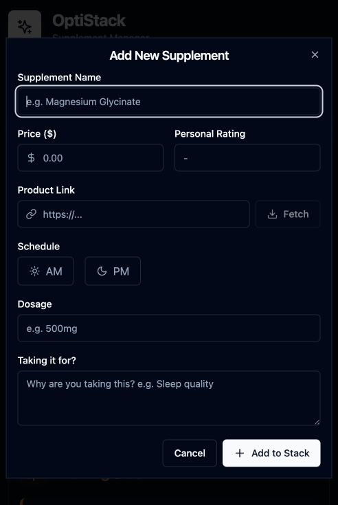

# OptiStack Supplement & Medication Manager

**Stop managing your health in spreadsheets.** 

OptiStack is a professional-grade, self-hosted platform designed for biohackers and health optimizers. It brings order to complex protocols with **AI-powered interaction analysis**, smart inventory tracking, precise timing schedules, and doctor-ready PDF reports. 

Whether you're taking a daily multivitamin or managing a complex longevity protocol, OptiStack handles the cognitive load—tracking dosages, checking for contraindications, and helping you stay consistent—all in a privacy-first, Docker-deployable package.

## Table of Contents

- [Why I Built This](#why-i-built-this)
- [Screenshots](#screenshots)
- [Quick Start](#quick-start)
  - [Option A: Quick Deploy](#option-a-quick-deploy-recommended)
  - [Option B: Clone and Build Locally](#option-b-clone-and-build-locally)
  - [Configuration](#configuration)
- [Environment Variables](#environment-variables)
  - [Single User Mode](#single-user-mode-disable-authentication)
- [Features](#features)
- [AI Features](#ai-features-optional)
  - [Cloud AI (OpenRouter)](#cloud-ai-openrouter)
  - [Local AI (Ollama)](#local-ai-ollama---privacy-first-option)
- [Mobile & PWA Support](#mobile--pwa-support)
- [Development](#development)
- [Acknowledgments](#acknowledgments)

## Why I Built This

As someone interested in biohacking and optimizing my own biology, my supplement stack eventually grew from a daily multivitamin into a complex protocol of specific compounds, timings, and cycling schedules. I found myself juggling messy spreadsheets, mental checklists, and random notes just to keep track of it all.

I built OptiStack to help with this. I wanted something that felt personal and handled the "cognitive load" of self-optimization—tracking inventory, checking for negative interactions, and helping me stay consistent. This project is my solution for bringing order to the chaos of managing a serious health protocol. I hope you find it useful!

> **Disclaimer: As with any biohacking tool, use at your own risk. I am not a doctor and this tool should not be used as a substitute for medical advice. Always consult with a healthcare professional before starting any new health protocol. Recognize that AI is not a substitute for medical advice and should not be used as a substitute for medical advice. AI can make mistakes and always double-check any recommendations with a healthcare professional or your own research.**

<details>
<summary>📸 Screenshots</summary>

### Dashboard

**Desktop**


**Mobile**

<p align="center">
  
</p>

### Add Supplement Form

**Desktop**


**Mobile**

<p align="center">
  
</p>

</details>

## Quick Start

### Option A: Quick Deploy (Recommended)

Run OptiStack directly from GitHub Container Registry — no clone required:

```bash
# Download the production compose file and example environment
curl -O https://raw.githubusercontent.com/tylermiranda/OptiStack/main/docker-compose.production.yml
curl -O https://raw.githubusercontent.com/tylermiranda/OptiStack/main/.env.example

# Create your .env file
cp .env.example .env
# Edit .env with your settings (see Required Secrets below)

# Run OptiStack
docker compose -f docker-compose.production.yml up -d
```

The application will be available at `http://localhost:3000`

---

### Option B: Clone and Build Locally

```bash
git clone https://github.com/tylermiranda/OptiStack.git
cd OptiStack
cp .env.example .env
# Edit .env with your settings
docker compose up -d
```

---

### Configuration

Edit `.env` with your configuration:

**Recommended secrets** — If not provided, random secrets will be generated at startup (invalidating sessions on restart, requiring re-login):
```bash
# Run this command twice, once for each secret
openssl rand -base64 48
```

- `JWT_SECRET` — Signs authentication tokens.
- `SESSION_SECRET` — Signs session cookies.

**Admin user** — Set `ADMIN_PASSWORD` for the default admin account (username defaults to `admin`).

### Login

On first startup, a default admin user is created:
- **Username:** `admin` (or value of `ADMIN_USERNAME`)
- **Password:** The value you set for `ADMIN_PASSWORD`

## Environment Variables

| Variable | Required | Default | Description |
|----------|----------|---------|-------------|
| `JWT_SECRET` | ⚠️ | Auto-generated | Secret for tokens. Set manually for persistent sessions. |
| `SESSION_SECRET` | ⚠️ | Auto-generated | Secret for cookies. Set manually for persistent sessions. |
| `ADMIN_PASSWORD` | ✅* | - | Password for default admin user |
| `ADMIN_USERNAME` | ❌ | `admin` | Username for default admin user |
| `AI_PROVIDER` | ❌ | `openrouter` | AI provider: `openrouter` (cloud) or `ollama` (local) |
| `OPENROUTER_API_KEY` | ❌ | - | [OpenRouter](https://openrouter.ai/keys) API key for cloud AI |
| `OLLAMA_URL` | ❌ | `http://localhost:11434` | Ollama server URL for local AI |
| `OLLAMA_MODEL` | ❌ | `llama3.1:8b` | Default Ollama model to use |
| `FRONTEND_URL` | ❌ | `http://localhost:3000` | Frontend URL for redirects |
| `OIDC_ISSUER` | ❌ | - | OIDC provider issuer URL |
| `OIDC_AUTH_URL` | ❌ | - | OIDC authorization endpoint |
| `OIDC_TOKEN_URL` | ❌ | - | OIDC token endpoint |
| `OIDC_USERINFO_URL` | ❌ | - | OIDC userinfo endpoint |
| `OIDC_CLIENT_ID` | ❌ | - | OIDC client ID |
| `OIDC_CLIENT_SECRET` | ❌ | - | OIDC client secret |
| `OIDC_CALLBACK_URL` | ❌ | `http://localhost:3000/auth/callback` | OIDC callback URL |
| `DISABLE_AUTH` | ❌ | `false` | Set to `true` to completely disable authentication (Single User Mode). **WARNING: Bypasses all login security.** |

*If `ADMIN_PASSWORD` is not set, the first user to register will become admin.

### Single User Mode (Disable Authentication)

You can set `DISABLE_AUTH=true` in your `.env` file to bypass the login screen. This enables "Single User Mode", where the default user has full admin privileges automatically.

**Recommended Scenarios:**
1. **Private Local Network**: Hosting on a secure home server (e.g., Unraid, Raspberry Pi) accessible only by you.
2. **Reverse Proxy Auth**: Using a service like Authelia or Authentik upstream to handle security, avoiding a "double login".
3. **Kiosk / Dashboard**: Displaying the app permanently on a wall-mounted tablet or smart display.

> **⚠️ Security Warning**: Never enable this if your instance is exposed directly to the public internet.

## Features

- 🔐 **Admin Dashboard**: Comprehensive user management and system settings
- 💊 **Weekly Refill Assistant**: Interactive checklist for easy pill organizer filling
- ⚖️ **Volume-based Costing**: Support for supplements by weight (grams, oz) or volume (ml) with accurate cost-per-day calculations
- 📄 **Comprehensive Doctor Report**: Export your daily supplement protocol to a professional PDF (with optional AI safety analysis)
- 📱 **Mobile-Optimized**: Responsive layout with safe-area support for iOS devices
- 🚀 **PWA Support**: Install to home screen on iPhone/Android for a native app experience
- ℹ️ **Smart Tooltips**: Enhanced interface with informative tooltips
- 🧬 **Bioavailability Tips**: Absorption tips, timing recommendations, and food guidance for 20+ common supplements
- 📋 **Stack Templates**: curated stacks for performance, sleep, focus, and longevity
- 👤 **Influencer Stacks**: Pre-built templates from health experts with source attribution
- 🔗 **Public Stack Sharing**: Generate shareable links for your stack
- 💾 **Data Backup & Restore**: Securely backup and restore your database
- 👤 **Single User Mode**: Optional mode to disable authentication for personal use

## AI Features (Optional)

OptiStack includes powerful AI features powered by **OpenRouter** (Cloud) or **Ollama** (Local):

- 💬 **AI Chat Assistant**: Conversational AI for checking interactions, getting recommendations, and evaluating new supplements
- 🩺 **Interaction Checker**: Analyze your stack for negative interactions and safety warnings
- 🧠 **Stack Optimizer**: Get suggestions for missing cofactors (e.g., K2 with D3) and complementary supplements
- 🔍 **Supplement Analysis**: Get AI-generated summaries, recommended dosages, side effects, and optimal timing for any supplement
- 📊 **Stack Analysis**: Analyze your entire protocol for synergies, benefits, and risks
- 📑 **Export AI Analysis**: Save interaction check results as a PDF report
- 📜 **AI Analysis History**: Automatically saves every analysis for future reference
- ✏️ **AI Prompt Editor**: Admins can customize the exact prompts used for all AI features
- 💰 **AI Cost Tracking**: Monitor token usage and costs per user (for Cloud AI) 

### Cloud AI (OpenRouter)

Use cloud-based AI models via [OpenRouter](https://openrouter.ai):

1. Get a free API key from [OpenRouter](https://openrouter.ai/keys)
2. Add it to your `.env` file: `OPENROUTER_API_KEY=sk-or-...`
3. Restart the container

### Local AI (Ollama) - Privacy-First Option

For complete privacy, OptiStack supports local AI via [Ollama](https://ollama.ai). All AI processing happens on your machine—no data leaves your network.

1. Install Ollama from https://ollama.ai
2. Pull a model: `ollama pull llama3.1:8b`
3. Set environment variables in `.env`:
   ```
   AI_PROVIDER=ollama
   OLLAMA_URL=http://localhost:11434
   OLLAMA_MODEL=llama3.1:8b
   ```
4. Restart the container

**Recommended Ollama Models:**
- `llama3.1:8b` - Good balance of speed and quality
- `mistral:7b` - Fast responses
- `gemma2:9b` - Google's open model

> **Note:** When running OptiStack in Docker, use `OLLAMA_URL=http://host.docker.internal:11434` to connect to Ollama running on your host machine.

If no AI provider is configured, the AI sections are completely hidden from the UI.

## Mobile & PWA Support

OptiStack is designed to work seamlessly on mobile devices:
- **Responsive Layout**: Adapts to all screen sizes with a mobile-first approach.
- **iOS PWA Ready**: Includes a `webmanifest`, standard Apple meta tags, and high-resolution icons for a native-like experience when added to the home screen.
- **Safe Area Support**: Automatically handles notches and home indicators on modern iOS devices.

## Development

```bash
# Install dependencies
npm install

# Run frontend dev server
npm run dev

# Run backend server (separate terminal)
npm run server
```

# Acknowledgments

Mostly created using [Antigravity](https://github.com/google-deepmind/antigravity) with Gemini Pro.

## License

MIT
